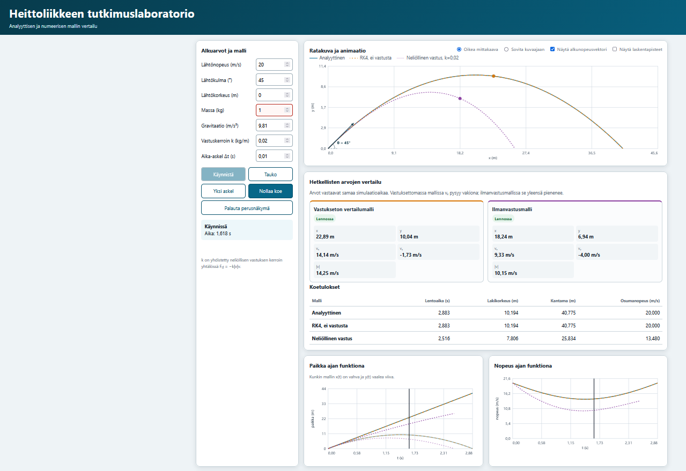
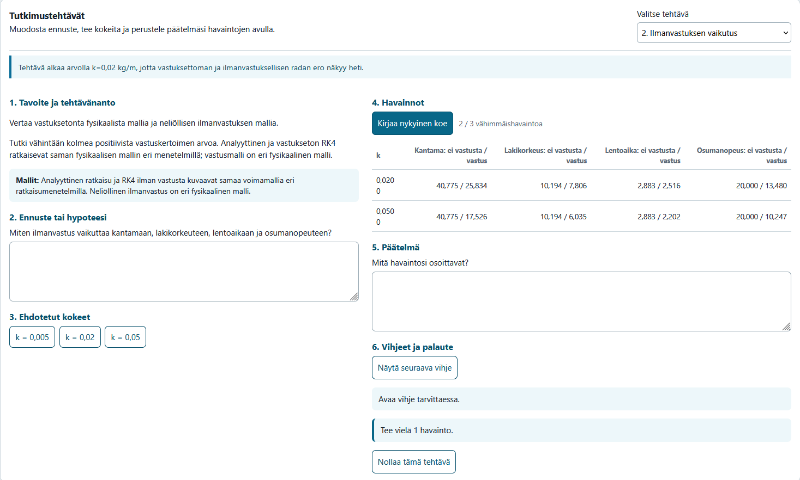

# Heittoliikkeen tutkimuslaboratorio

Täysin offline-toimiva lukion fysiikan selain­sovellus heittoliikkeen tutkimiseen. Sovellus vertailee analyyttistä ilmanvastuksetonta mallia, vastaavaa numeerista RK4-ratkaisua ja neliöllisen ilmanvastuksen mallia.

## Kuvakaappaukset

### Simulaatio ja mallien vertailu

### Ohjatut tutkimustehtävät

## Kokeile sovellusta verkossa

[Avaa Heittoliikkeen tutkimuslaboratorio](https://jh-scienceworks.github.io/heittoliikkeen-tutkimuslaboratorio/)

## Käynnistäminen

1. Avaa `index.html` Windowsin tiedostoselaimesta Firefoxiin tai Chromeen.
2. Automaattiset testit voi ajaa avaamalla `tests/test-runner.html` selaimessa.
3. Asennusta, palvelinta, npm:ää, build-vaihetta tai verkkoyhteyttä ei tarvita.

## Jaettava standalone-versio

Ensimmäinen jaettava versio on `heittoliikkeen-tutkimuslaboratorio-standalone.html`, versio 1.0.0, muodostettu 13.7.2026. Avaa tiedosto suoraan Windowsin tiedostoselaimesta Firefoxiin tai Chromeen. Jakamista varten tarvitsee lähettää vain tämä yksi HTML-tiedosto; sen rinnalle ei tarvita muita tiedostoja tai kansioita.

Standalone-versio sisältää kehitysversion HTML:n, CSS:n ja JavaScriptin sisäisesti samassa latausjärjestyksessä. Kehitys- ja standalone-versiot ovat toiminnallisesti vastaavat. Standalone ei käytä verkkoyhteyttä, ulkoisia resursseja, analytiikkaa, evästeitä eikä pysyvää selaintallennusta. Opiskelijan kirjoittamat tekstit ja havainnot säilyvät vain avoimen sivun muistissa ja katoavat, kun tiedosto suljetaan tai ladataan uudelleen.

## Tuetut selaimet ja saavutettavuus

Sovellus on suunniteltu paikallisesti avattavaksi ajantasaisilla Windowsin Firefox- ja Chrome-selaimilla. Asettelu mukautuu koko näytön, tavallisen kannettavan, noin 1000–1100 pikselin sekä kapeisiin pystysuuntaisiin näkymiin. Responsiiviset katkaisupisteet tukevat myös 125 % ja 150 % selainzoomausta. Julkaisua edeltävän loppuauditoinnin tulokset on koottu tiedostoon `AUDIT_REPORT.md`.

Kaikkia painikkeita, valintoja ja lomakekenttiä voi käyttää näppäimistöllä. Interaktiivisilla elementeillä on näkyvä fokusmerkintä sekä erilliset aktiiviset ja käytöstä poistetut tilat. Canvas-kuvaajilla on tekstimuotoiset saavutettavat yhteenvedot, ja hetkelliset arvot näytetään rinnakkain vastuksettomalle vertailumallille ja ilmanvastusmallille. Leveät havainto- ja tulostaulukot vierittyvät tarvittaessa oman alueensa sisällä.

## Ominaisuudet

- analyyttinen heittoliike ja kaksi RK4-mallia
- säädettävät alkuarvot, animaatio, ratakuva, paikka- ja nopeuskuvaajat
- lentoajan, lakikorkeuden, kantaman ja osumanopeuden vertailu
- ratakuvan geometrisesti oikea oletusmittakaava ja vaihtoehtoinen sovitustila
- alkunopeusvektori, kulmakaari ja lähtökulman arvo
- kolme ohjattua tutkimustehtävää havaintotaulukoineen
- täysin istuntokohtainen työskentely ilman pysyvää tallennusta tai verkkopyyntöjä

## Ratakuvan käyttäminen

**Oikea mittakaava** näyttää metrin yhtä suurena molemmilla akseleilla ja säilyttää radan kulmat sekä muodon. **Sovita kuvaajaan** käyttää kuva-alan tehokkaammin, mutta voi vääristää geometriaa; sovellus näyttää tällöin varoituksen. Alkunopeusvektorin voi näyttää tai piilottaa omalla valintaruudullaan.

## Tutkimustehtävät

Sovellus käynnistyy neutraalissa vapaan tutkimisen näkymässä perusasetuksilla, eikä mikään tutkimustehtävä ole aktiivinen. Valitse paneelista tehtävä, kirjoita hypoteesi, käytä ehdotettuja parametreja tai omia arvoja ja paina **Kirjaa nykyinen koe**. Havainto lisätään aktiivisen tehtävän taulukkoon. Kirjoita lopuksi päätelmä havaintojen perusteella. Kolme vaikeutuvaa vihjettä avautuvat yksi kerrallaan. Kolmannen jälkeen vihjesarjan voi aloittaa uudelleen ensimmäisestä. Kevyt palaute kertoo esimerkiksi puuttuvista havainnoista tai parametriarvoista.

**Palauta perusnäkymä** poistaa aktiivisen tehtävän, tyhjentää kaikki tehtäväistunnot ja palauttaa yleiset asetukset. **Nollaa tämä tehtävä** säilyttää nykyisen tehtävävalinnan, tyhjentää vain sen vastaukset ja havainnot sekä palauttaa tehtävän omat lähtöasetukset.

Tekstit ja havainnot säilyvät vain niin kauan kuin sivu on avoinna. Tehtävän vaihtaminen säilyttää muiden tehtävien hypoteesit, päätelmät ja havainnot, mutta palauttaa valitun tehtävän vihjeet alkutilaan. Sivun sulkeminen poistaa kaiken opiskelijan kirjoittaman sisällön.

Syötekentät hylkäävät tyhjät, ei-äärelliset ja sallittujen rajojen ulkopuoliset arvot. Sovellus keskeyttää myös laskennan selkeällä virheilmoituksella, jos parametriyhdistelmä vaatisi kohtuuttoman suuren näytemäärän tai tekisi kiinteäaskelisesta RK4-laskennasta epävakaan.

Tehtävä 1 käyttää tarkoituksella arvoa `k=0`; tällöin kaikki kolme rataa ovat päällekkäin, koska neliöllisen vastuksen termi häviää. Tehtävä 2 käynnistyy arvolla `k=0,02 kg/m` ja tarjoaa kolme positiivista vastuskerrointa. Tehtävä 3 käyttää aika-askelia 0,5; 0,2; 0,05 ja 0,01 s sekä näyttää RK4-laskentapisteet. Vakion kiihtyvyyden tapauksessa RK4:n tunnuslukuvirhe voi jäädä hyvin pieneksi, vaikka harva näytteistys tekee ratakuvasta kulmikkaan.

## Tiedostorakenne

- `index.html` — sovelluksen käynnistyssivu
- `heittoliikkeen-tutkimuslaboratorio-standalone.html` — yhden tiedoston jaettava versio 1.0.0
- `css/` — perus- ja pedagogisen käyttöliittymän tyylit
- `js/physics.js`, `js/integrator.js` — fysiikkaydin ja RK4
- `js/simulation.js` — simulaation ohjaus
- `js/axis.js`, `js/trajectory-view.js`, `js/charts.js` — akselit, ratakuvan muunnokset ja Canvas-piirto
- `js/tasks-data.js` — tutkimustehtävien rakenteinen sisältö
- `js/task-engine.js`, `js/tasks-ui.js` — tehtäväistuntojen logiikka ja käyttöliittymä
- `tests/` — selaimessa ajettavat automaattiset testit
- `tests/standalone-audit.js` — kehitys- ja standalone-versioiden paketointi-, toiminnallisuus- ja turvallisuusvertailu
- `AUDIT_REPORT.md` — julkaisua edeltävän loppuauditoinnin havainnot ja johtopäätökset
- `STANDALONE_BUILD_REPORT.md` — standalone-version muodostamis- ja varmennusraportti
- `PROJECT_PLAN.md` — täydellinen projektisuunnitelma ja rajauspäätökset

## Rajaukset

Sovellus ei tallenna tai vie tehtävävastauksia, arvioi vapaamuotoista tekstiä tai sisällä käyttäjätilejä. Uudet fysiikkamallit sekä hetkelliset nopeus-, kiihtyvyys- ja voimavektorit on rajattu myöhempään versioon 1.1.

## Kehitystapa, oma rooli ja tekoälyn käyttö

Projekti on toteutettu tekoälyavusteisesti OpenAI Codexissa käyttäen GPT-5.6 Sol -mallia.

Projektin pedagoginen tavoite, fysiikan sisältö, ominaisuusrajaukset, käyttöliittymän arviointi, testaus ja lopulliset hyväksymispäätökset ovat tekijän vastuulla. Codexia käytettiin projektin suunnittelun tukena sekä koodin, testien ja teknisen dokumentaation tuottamiseen ja tarkistamiseen.

Kaikki julkaistut toiminnot on tarkistettu automaattisilla testeillä ja manuaalisesti Firefox- ja Chrome-selaimissa.
